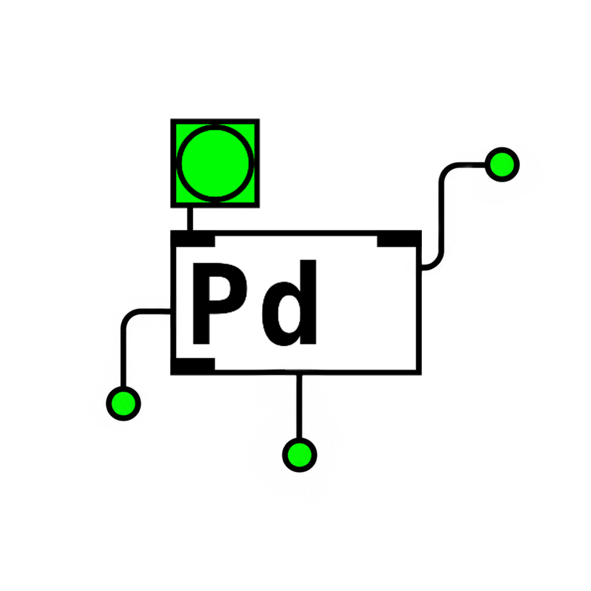

<p align="right">
  <a href="README.md">English</a> | <a href="README.ko.md">한국어</a> | 日本語
</p>

# PureData-MCP

<p align="center">
  
</p>

[Pure Data](https://puredata.info/)をAIエージェントからMCP経由で起動、制御、ライブパッチできるサーバーです。

PureData-MCPは、MCPクライアントからPdを起動し、見えるGUIパッチを開き、Vanilla `.pd` パッチを生成し、実行中のパッチのオブジェクトや接続を編集できるようにします。目標はシンプルです。自然言語で音を頼み、Pure Dataが楽器になっていく様子を見ることです。

Pure Data、またはPd/Pd Vanillaは、Miller Pucketteによって作られ、Pdコミュニティによって維持されているオープンソースのマルチメディア向けビジュアルプログラミング言語です。このプロジェクトはPure Dataプロジェクトとは独立しており、公式な提携または承認を受けたものではありません。このような制作を可能にしているPure Dataの作者とコミュニティに感謝します。

## Quick Start

[Pure Data](https://puredata.info/downloads)とNode.js 20以上をインストールし、npmでMCPサーバーを実行します。

```bash
npx -y @damagethundercat/puredata-mcp
```

多くの場合、このコマンドを直接実行するのではなく、Codex、Claude Code、Cursor、VS CodeなどのMCPクライアントに設定します。

## Codexに接続する

CodexのMCP設定に追加します。

```toml
[mcp_servers.puredata]
command = "npx"
args = ["-y", "@damagethundercat/puredata-mcp"]
```

Windowsでは、PowerShellのnpmポリシー問題を避けるために `cmd /c` を使うのがおすすめです。

```toml
[mcp_servers.puredata]
command = "cmd"
args = ["/c", "npx", "-y", "@damagethundercat/puredata-mcp"]
```

設定を変更したらCodexを再起動してください。

## 他のMCPクライアント

JSON形式のMCP設定を使うクライアントでは、次のように追加します。

```json
{
  "mcpServers": {
    "puredata": {
      "command": "npx",
      "args": ["-y", "@damagethundercat/puredata-mcp"]
    }
  }
}
```

Windowsでは次のように設定します。

```json
{
  "mcpServers": {
    "puredata": {
      "command": "cmd",
      "args": ["/c", "npx", "-y", "@damagethundercat/puredata-mcp"]
    }
  }
}
```

## 試してみる

サーバーを接続したら、エージェントにこう頼んでみてください。

```text
osc~ -> *~ -> dac~ の信号チェーンが見えるPure Dataパッチを作ってください。
```

```text
Pure Data GUIの1つのウィンドウに、キック、ハイハット、ベース、ミキサー、dac~が見える120BPMの電子音楽ループを作ってください。
```

```text
現在のパッチにディレイエフェクトを追加し、出力は小さめに保ってください。
```

```text
ベースのセクションを左に移動し、古いハイハットオブジェクトを削除して、ミキサーに再接続してください。
```

## できること

- ローカルのPure Dataを起動/停止
- headless Pdまたは表示されるPd GUIを開く
- 小さなVanilla `.pd` パッチを生成
- TCP FUDIでfrequency、amplitude、gate、DSPを制御
- エージェントが所有するlive patch graphの追加、接続、移動、更新、削除、置換、クリア、確認
- オーディオデバイス一覧とセッション状態/ログの確認

## Tools

PureData-MCPは小さなMCPツールセットを提供します。

- Lifecycle: `pd_start_demo`, `pd_stop`, `pd_status`
- Audio: `pd_set_params`, `pd_list_audio_devices`
- Patch preview: `pd_preview_patch`
- Live GUI editing: `pd_live_add_object`, `pd_live_connect`, `pd_live_move_object`, `pd_live_update_object`, `pd_live_remove_object`, `pd_live_disconnect`, `pd_live_replace_graph`, `pd_live_clear`, `pd_live_graph`

Live editingツールを使うと、エージェントが実行中のPure Data GUIパッチを構築し、編集できます。

## Resources

- `pd://session/status`
- `pd://patch/current`
- `pd://logs/recent`
- `pd://schema/parameters`
- `pd://live/graph`

## ローカルデモ

同梱デモを直接実行する場合は、リポジトリをクローンします。

```bash
git clone https://github.com/damagethundercat/PureData-MCP.git
cd PureData-MCP
npm install
npm run build
```

現在の電子音楽リズムデモを実行します。

```bash
npm run demo:electro
```

Windows PowerShellでは、次の形式をおすすめします。

```powershell
cmd /c npm run demo:electro
```

デモパッチは `patches/electro-rhythm-loop.pd` にあります。

## Development

```bash
npm run test:unit
npm run typecheck
npm run build
```

任意でPd統合テストを実行できます。

```bash
PD_INTEGRATION=1 PD_EXE="/path/to/pd" npm run test:pd
```

Windows:

```powershell
$env:PD_EXE="C:\Program Files\Pd\bin\pd.com"
$env:PD_INTEGRATION="1"
cmd /c npm run test:pd
```

## Troubleshooting

- Pdが見つからない場合は、headlessセッションには `PD_EXE`、GUIセッションには `PD_GUI_EXE` を設定してください。
- 音が出ない、または別のデバイスに出力される場合は、エージェントに `pd_list_audio_devices` を実行させ、正しい `audioOutDevice` で再起動してください。
- WindowsでPowerShellがnpmスクリプトをブロックする場合は、`cmd /c npm ...` で実行してください。

## License

MIT
